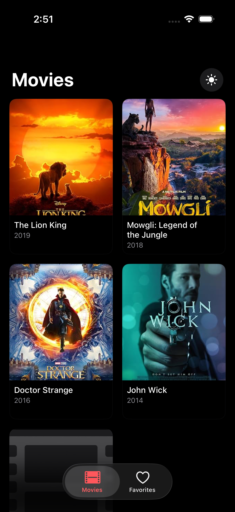
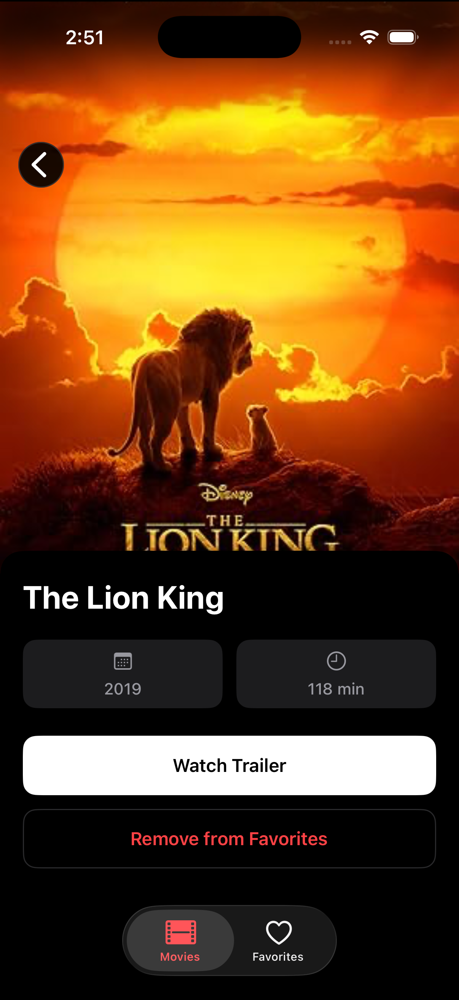

# Movie App 🎬
A modern iOS movie discovery app built with **MVVM + Coordinator** architecture, featuring reactive programming with RxSwift.

## ✨ Features
- 🎥 **Movie List** - Browse movies with beautiful poster cards
- 📖 **Movie Details** - View comprehensive movie information
- ❤️ **Favorites** - Save and manage your favorite movies
- 🎞️ **Trailer Integration** - Watch movie trailers directly
- 🌓 **Dark Mode** - Seamless light/dark theme switching

## 📱 Screenshots

| Movie List | Movie Details |
|:----------:|:-------------:|
|  |  |
| Browse movies with beautiful poster cards in a 2-column grid | Detailed view with poster, runtime, year, and action buttons |

## 🏗️ Architecture
This project demonstrates **professional iOS architecture** with:
- **MVVM Pattern** - Clean separation between View, ViewModel, and Model
- **Coordinator Pattern** - Centralized navigation flow
- **Repository Pattern** - Data persistence abstraction
- **Protocol-Oriented Design** - Dependency injection and testability
- **Reactive Programming** - RxSwift for data binding

## 🛠️ Tech Stack
- **Language:** Swift
- **UI Framework:** UIKit (Programmatic - No Storyboard)
- **Reactive:** RxSwift & RxCocoa
- **Architecture:** MVVM + Coordinator
- **Networking:** URLSession with Observable
- **Persistence:** UserDefaults (Repository Pattern)
- **Testing:** XCTest with Mock implementations

## 📂 Project Structure
```
movieApp/
├── Application/          # App lifecycle & coordinators
├── Models/              # Data models
├── Screens/             # Feature modules (MVVM)
│   ├── MovieList/       # List screen with ViewModel & Coordinator
│   ├── MovieDetails/    # Details screen with ViewModel & Coordinator
│   └── Favorites/       # Favorites screen with ViewModel & Coordinator
├── Services/            # Business logic layer
│   ├── MovieAPIService.swift
│   ├── FavoritesRepository.swift
│   └── ThemeManager.swift
└── Components/          # Reusable UI components
```

## 🎯 SOLID Principles
- ✅ **Single Responsibility** - Each class has one clear purpose
- ✅ **Open/Closed** - Extensible through protocols
- ✅ **Liskov Substitution** - Protocol implementations are interchangeable
- ✅ **Interface Segregation** - Focused protocol definitions
- ✅ **Dependency Inversion** - Depends on abstractions, not concretions

## 🧪 Testing
Includes comprehensive unit tests:
- ✅ ViewModel tests with mock services
- ✅ Repository tests with mock storage
- ✅ API service tests
- ✅ Dependency injection for testability

## 🚀 Getting Started
```bash
# Clone the repository
git clone https://github.com/yourusername/movieApp.git
cd movieApp

# Open in Xcode
open movieApp.xcodeproj

# Install dependencies (if using CocoaPods/SPM)
# RxSwift should be already configured

# Build and run
⌘ + R
```

## 📦 Dependencies
- [RxSwift](https://github.com/ReactiveX/RxSwift) - Reactive programming
- [RxCocoa](https://github.com/ReactiveX/RxSwift) - RxSwift UIKit bindings

## 🎨 Design Highlights
- 🎨 Modern UI with rounded corners and shadows
- 📱 Responsive collection view layouts
- 🌈 Dynamic theming support
- ♿ Accessibility-friendly design
- 🎭 Smooth animations and transitions

## 📝 Key Learnings
This project demonstrates:
- Clean architecture principles
- Reactive data binding patterns
- Navigation coordination
- Dependency injection
- Unit testing best practices
- Protocol-oriented programming

---

**Built with 💙 to showcase iOS architecture mastery**

